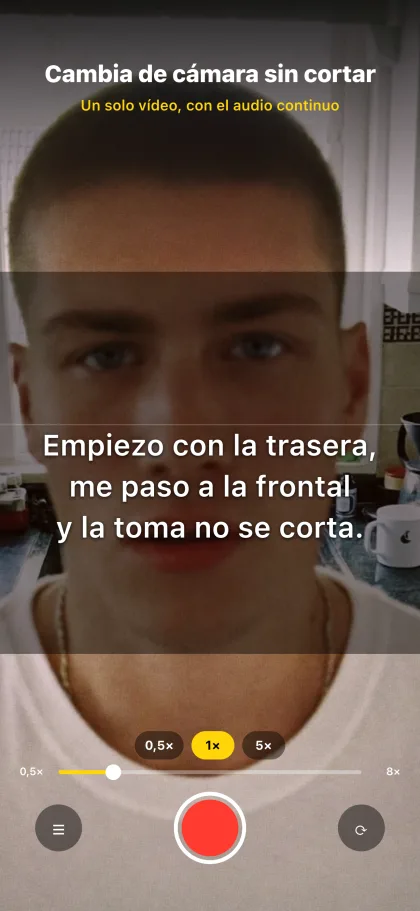
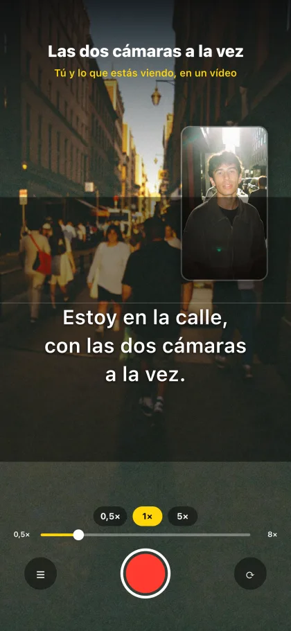
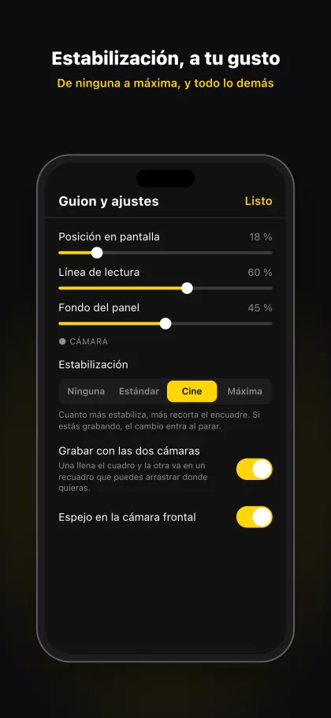
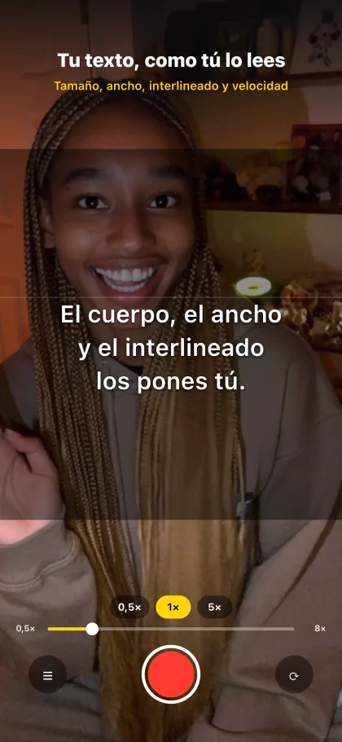
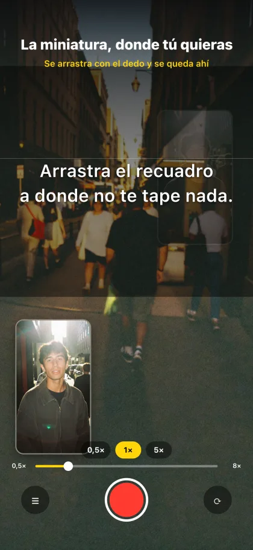

# Prompter

Teleprompter y cámara en el mismo iPhone. Abres, lees y grabas: sin Mac de
servidor, sin iPad de visor y sin Wi-Fi de por medio.

Es el hermano de bolsillo de [`fuck_premium_teleprompters`](https://github.com/eljommys/fuck_premium_teleprompters);
comparte con él la mecánica de desplazamiento del guion, pero aquí todo pasa en
un solo aparato.

## Qué hace

- Una sola pantalla: la cámara a pantalla completa, vertical 9:16.
- El guion en una banda central. **Arrástralo con el dedo** para moverlo a mano,
  **tócalo** para que avance solo y otra vez para pararlo.
- **Gira entre la cámara trasera y la frontal sin cortar la grabación**: la toma
  sigue siendo un único vídeo, con el audio continuo.
- Zoom por lentes reales en la trasera (0,5× / 1× / 3×, los que tenga tu modelo)
  y zoom digital en la frontal. Pellizca en cualquier parte fuera de la banda.
- Al parar, la toma va directa a tu Carrete, en `.mov` y con el códec eficiente:
  el mismo contenedor y la misma calidad que graba la cámara del sistema.
- **Acceso directo a Fotos** en una esquina, con la miniatura de tu último vídeo.
- **60 fps** cuando la cámara del modelo los da. Con las dos cámaras a la vez no
  entra, y ahí se graba a lo de siempre.
- **Exposición y linterna** a mano, sin salir de la pantalla de grabar, y se
  pueden mover en mitad de una toma. La corrección de exposición se guarda.
- **La línea de lectura se mueve**: subirla te acerca al objetivo de la cámara
  frontal, que es lo que hace que parezca que miras a cámara.
- **Graba con las dos cámaras a la vez**: una llena el cuadro y la otra va en un
  recuadro que arrastras donde quieras. Puedes girar y mover el recuadro en
  mitad de la toma, y el vídeo enseña cada cambio donde lo hiciste. Al parar, las
  dos tomas se funden en un solo fichero.
- Estabilización de vídeo elegible, de ninguna a máxima.
- Texto, ancho y tamaño de letra, velocidad, interlineado, alto y opacidad del
  panel: todo ajustable, y se queda guardado.

## Cómo se ve

| | | |
|:-:|:-:|:-:|
|  |  |  |
| Gira sin cortar la toma | Las dos cámaras a la vez | Todo ajustable |
|  |  | |
| El guion a tu medida | El recuadro, donde quieras | |

## Arrancar

Necesita un iPhone de verdad: el simulador no tiene cámara. Y **no funciona en
Expo Go** — VisionCamera es código nativo, así que hace falta una build propia.

```bash
npm install
npx expo prebuild --platform ios   # ya está hecho, solo si borras ios/
npx expo run:ios --device          # con el iPhone conectado por cable
```

La primera vez Xcode pedirá un equipo de firma. Con una cuenta de Apple gratuita
la app caduca a los 7 días y hay que reinstalarla; con cuenta de desarrollador,
un año.

### Un parche a Expo, de momento

`expo-modules-jsi@57.0.4` no compila con Xcode 26 / Swift 6.2: el compilador
declara ambigua una comparación entre dos `Double` en `JavaScriptCodable+Date.swift`.
Es un fallo de Expo ([expo/expo#47957](https://github.com/expo/expo/issues/47957)),
todavía sin arreglar en la última versión publicada.

`patches/expo-modules-jsi+57.0.4.patch` lo esquiva comparando contra literales, y
`patch-package` lo vuelve a aplicar en cada `npm install` desde el `postinstall`.
Cuando Expo publique el arreglo, borra el parche y quita `patch-package`.

## Cómo está montado

| Fichero                    | Qué hace                                                            |
| -------------------------- | ------------------------------------------------------------------- |
| `App.tsx`                  | La pantalla: cámara, banda del guion, controles y permisos.          |
| `lib/prompterSettings.ts`  | Tipos, límites y las fórmulas de velocidad y rellenos.               |
| `lib/useScriptScroll.ts`   | El bucle de desplazamiento, en el hilo de UI.                        |
| `lib/useSettings.ts`       | Lectura y guardado diferido de los ajustes.                          |
| `lib/useRecorder.ts`       | Ciclo de una toma y guardado en el Carrete.                          |
| `lib/useLastVideo.ts`      | El último vídeo del Carrete, para el acceso directo a Fotos.         |
| `lib/zoom.ts`              | Las dos escalas de zoom de VisionCamera y las paradas de lente.      |
| `components/`              | Banda del guion, barra de controles, botones de lente y ajustes.     |

### Dos detalles que no son obvios

**La posición del guion se guarda normalizada (0..1), nunca en píxeles.** Con los
rellenos del 40 % y el 60 % del alto de la banda, el recorrido medido es
exactamente la altura del texto, así que cambiar el alto del panel o el cuerpo de
letra no te mueve del sitio del guion en el que ibas.

**La grabación aguanta el cambio de cámara gracias a `enablePersistentRecorder`.**
En iOS eso cambia la tubería interna a `AVCaptureVideoDataOutput` + `AVAssetWriter`,
que sobrevive a que se reconfigure la entrada de la sesión. Sin esa opción, girar
la cámara cierra la toma.

### Panel de depuración

Mantén pulsada la esquina superior izquierda para ver los números crudos de la
cámara: tipo de dispositivo, `minZoom` / `maxZoom`, `zoomLensSwitchFactors` y la
escala de zoom calculada. Está ahí para comprobar de un vistazo que las paradas
de lente salen donde deben en tu modelo concreto.
